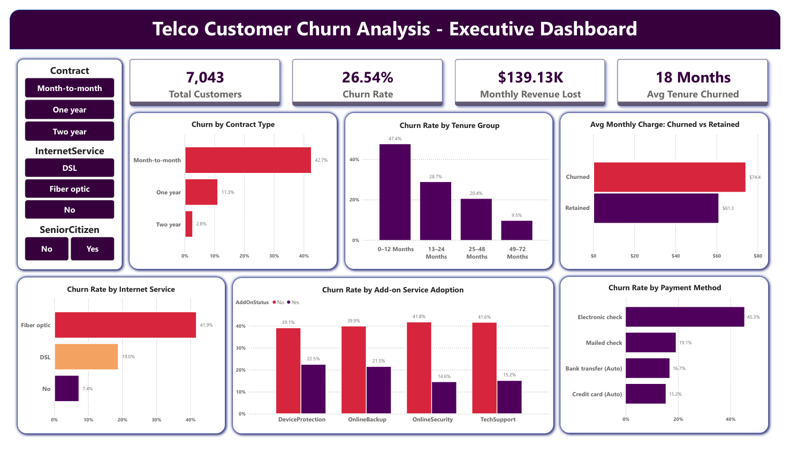

# Telco Customer Churn Analysis

An end-to-end business intelligence project analysing customer churn for a telecom company. Built across four phases — data cleaning, exploratory data analysis, SQL querying, and an interactive Power BI dashboard.

---

## Business Problem

A telecom company serving 7,043 customers is experiencing a churn rate of **26.54%** — roughly 1 in every 4 customers cancels their service each year. This translates to **$139,131 in monthly recurring revenue lost** and **$1.67 million annualised**.

The business had no clarity on who was churning, why they were leaving, or when in the customer lifecycle the risk was highest. This project investigates those questions and delivers targeted, data-backed recommendations.

---

## Key Findings

**1. Contract type is the #1 churn driver**
Month-to-month customers churn at **42.7%** compared to just **2.8%** for two-year customers — a 15x gap. With 3,875 customers on monthly contracts (55% of the base), this segment alone drives **86.9% of all revenue lost** ($120,847/month).

**2. The first 12 months is the critical retention window**
**47.4%** of new customers churn before completing their first year. The median churn happens at just **10 months**. After 4 years, churn drops to 9.5% — customers who stay become loyal.

**3. Churned customers pay more — not less**
Churned customers pay an average of **$74.44/month** versus **$61.27** for retained customers — a $13.18 difference. This rules out price as the cause and points to a value perception problem.

**4. The fiber optic paradox**
Fiber optic is the most expensive service ($91.50/month avg) yet has the highest churn at **41.9%** — more than twice the DSL rate of 19.0%. This segment accounts for **82% of total monthly revenue lost** ($114,300/month).

**5. Add-on services nearly triple retention**
Among internet customers, those without OnlineSecurity churn at **41.8%** versus **14.6%** for those with it — a 27 percentage point gap. The same pattern holds for TechSupport, OnlineBackup, and DeviceProtection.

**6. Electronic check payers are 3x more likely to churn**
Electronic check customers churn at **45.3%** compared to **15.2%** for credit card auto-pay users. Auto-pay signals commitment; manual payment creates a monthly decision point.

**Highest-risk segment identified:**
Customers who are on a month-to-month contract, use fiber optic internet, pay by electronic check, and have a tenure of 12 months or less — **631 customers with a 71.2% churn rate**, losing $37,166/month.

---

## Business Recommendations

**1. Contract upgrade campaign**
Target the 3,875 month-to-month customers with an offer — one month free for switching to an annual plan. Directly addresses 86.9% of all revenue loss.

**2. Bundle add-ons free for 90 days**
Give new fiber optic customers OnlineSecurity and TechSupport at no cost for the first three months. Solves the fiber churn problem and the low add-on adoption problem simultaneously.

**3. Auto-pay incentive**
Offer a $5/month discount for switching to automatic payment, targeting the 2,365 electronic check payers on month-to-month contracts. Retaining one customer at $74.44/month pays back that discount nearly 15x in a year.

---

## Dashboard Preview



---

## Project Structure

```
telco-churn-analysis/
│
├── data/
│   ├── WA_Fn-UseC_-Telco-Customer-Churn.csv
│   └── telco_churn_cleaned.csv
│
├── notebooks/
│   ├── 01_data_cleaning.ipynb            ← Data Cleaning & Feature Engineering
│   └── 02_EDA.ipynb                      ← Exploratory Data Analysis
│
├── sql/
│   └── telco_churn_queries.sql           ← 12 SQL queries
│
├── dashboard/
│   ├── telco_churn_dashboard.pbix        ← Power BI Dashboard
│   └── dashboard_preview.png             ← Dashboard screenshot
│
├── PROBLEM_STATEMENT.pdf
└── README.md
```

---

## Phase 1 — Data Cleaning & Feature Engineering

**Notebook:** `01_data_cleaning.ipynb`
**Input:** `WA_Fn-UseC_-Telco-Customer-Churn.csv` (21 columns, 7,043 rows)
**Output:** `telco_churn_cleaned.csv` (28 columns)

Key decisions made:

- **TotalCharges fix** — Column was stored as a string. 11 rows had blank values, all with tenure = 0. These were brand-new customers who had never been billed, so their total charge was genuinely zero. Imputed 0 rather than dropping them to preserve valid customers.
- **SeniorCitizen conversion** — Original column stored 0 and 1. Converted to Yes/No for visual consistency with all other categorical columns.
- **tenure_group engineering** — Bucketed the 0–72 month tenure range into four lifecycle stages: 0-12 Months, 13-24 Months, 25-48 Months, 49-72 Months. Enables lifecycle-based churn analysis.
- **Binary encoding** — Created `_enc` versions of five Yes/No columns (SeniorCitizen, Partner, Dependents, PaperlessBilling, Churn) for correlation analysis while preserving originals for charts.

---

## Phase 2 — Exploratory Data Analysis

**Notebook:** `02_EDA.ipynb`
**Input:** `telco_churn_cleaned.csv`

9 charts built, each answering a specific business question:

| Chart | Business Question |
|---|---|
| Overall Churn Distribution | How bad is the problem? |
| Churn by Contract Type | Which contract drives the most churn? |
| Churn by Tenure Group | When in the lifecycle does churn peak? |
| Monthly Charges — Churned vs Retained | Are we overcharging churned customers? |
| Churn by Internet Service | Is fiber optic a churn driver? |
| Churn by Add-on Services | Do add-ons improve retention? |
| Churn by Payment Method | Does auto-pay reduce churn? |
| Revenue at Risk | What is the financial impact? |
| Correlation Heatmap | Which features correlate most with churn? |

---

## Phase 3 — SQL Analysis

**File:** `telco_churn_queries.sql`
**Tool:** MySQL

12 queries covering:

- Overall churn rate and customer baseline
- Average tenure and monthly charges by churn status
- Churn rate and revenue lost by contract type
- Churn rate by tenure group (with custom CASE ORDER BY for lifecycle ordering)
- Total revenue at risk — monthly, annual, and percentage
- Churn rate by internet service type with average monthly charge
- Churn rate by payment method
- Add-on service impact using UNION ALL across OnlineSecurity and TechSupport
- Highest-risk customer segment using multi-condition WHERE
- High-value customers at risk using a correlated subquery
- Percentage of total churn by contract type using a window function (SUM OVER)

---

## Phase 4 — Power BI Dashboard

**File:** `telco_churn_dashboard.pbix`

Single-page executive dashboard with:

- **4 KPI cards** — Total Customers, Churn Rate, Monthly Revenue Lost, Avg Tenure of Churned Customers
- **5 charts** — Contract type, Tenure lifecycle, Monthly charges comparison, Internet service, Payment method, Add-on services
- **3 slicers** — Contract type, Internet service, Senior citizen status
- Add-on chart built using Power Query Unpivot to reshape 4 wide columns into long format for grouped visualisation

Data connected directly from MySQL database.

---

## Dataset

| Attribute | Details |
|---|---|
| Source | IBM Watson Analytics Sample Dataset via Kaggle |
| Rows | 7,043 customers |
| Raw columns | 21 |
| Engineered columns | 7 additional (tenure_group + 6 encoded) |
| Target variable | Churn — Yes / No |
| Churn rate | 26.54% |

---

## Tools & Technologies

| Tool | Purpose |
|---|---|
| Python 3 | Data cleaning, feature engineering, EDA |
| Pandas | Data manipulation |
| Matplotlib / Seaborn | Visualisations |
| MySQL | Structured query analysis |
| Power BI Desktop | Executive dashboard |
| Jupyter Notebook | Development environment |

---

## Author

**Aditya**
BCA Graduate | Aspiring Data Analyst | Bangalore, India

*Dataset: IBM Watson Analytics via [Kaggle](https://www.kaggle.com/datasets/blastchar/telco-customer-churn)*
